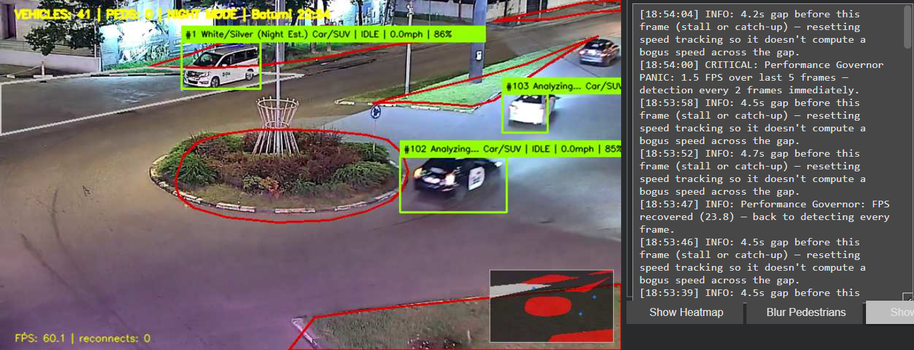
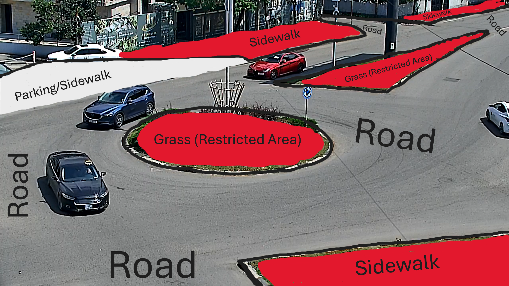
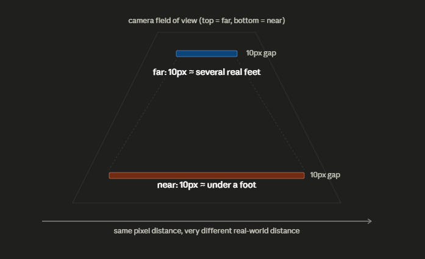
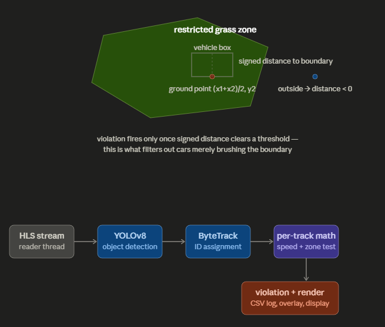

# AI Traffic & Surveillance System (Batumi)

A real-time computer vision pipeline that takes a public live traffic camera feed and turns it into a working monitoring system: vehicle/pedestrian/scooter detection and tracking, per-vehicle speed estimation from raw pixel motion, zone-violation detection (grass, sidewalk, restricted areas) using signed-distance polygon tests, congestion and gridlock detection, and a live admin dashboard — all running as local inference, no external vision API.

I built this solo for a UG Engineering hackathon and ran out of time before I could take it further. Everything below is real and running; I'm documenting it properly so whoever picks this up next doesn't have to reverse-engineer the math from the code. See "Known Limitations / Where to Take This Next" before you extend it.


*Live output: 60.1 FPS, 0 reconnects, gap-reset logic firing correctly during a real network hiccup (note the "resetting speed tracking" log lines instead of a bogus spike), night mode active with per-vehicle color estimation.*

---

## What it actually does

It pulls a live HLS video stream from a public traffic camera, runs YOLOv8 object detection + ByteTrack tracking on each frame, and then layers a bunch of logic on top of the raw detections:

- **Vehicle / pedestrian / scooter tracking** with persistent IDs across frames
- **Speed estimation** per vehicle, using pixel movement between frames converted to real-world feet using a depth-correction multiplier (things further from the camera move fewer pixels per real foot)
- **Zone violation detection** — polygons drawn over the frame mark restricted grass, sidewalk, and parking areas. A vehicle whose ground-contact point lands inside one of those triggers a violation
- **Vehicle color detection** using k-means clustering on the cropped vehicle region, with separate day/night color-correction logic
- **Day/night mode switching**, based on time of day and a fallback brightness check on the frame itself, which changes contrast enhancement, color detection thresholds, and violation sensitivity
- **Congestion + roundabout gridlock detection**, based on sustained vehicle counts and stationary-vehicle clustering
- **Violation logging** to CSV, with snapshot images saved per violation, and a "storm" detector that auto-mutes logging if it looks like the zone calibration is wrong instead of a real mass violation (this saves you from a wall of false CRITICAL logs and, more importantly, from spamming Drive with writes)
- **A live admin panel** in the notebook (log feed, stats, heatmap toggle, pedestrian-blur toggle, minimap toggle) built with `ipywidgets`

None of this needs a paid API or cloud vision service — it's all local inference (YOLOv8 via `ultralytics`) on whatever GPU Colab gives you.

---

## Camera Source

This project is built around **[icam.ge's Batumi live camera feed](https://icam.ge/live-cameras/batumi-live)**, specifically re-streamed through an `rtsp.me` HLS relay link.

**Important thing to know before you touch `STREAM_URL`:** the `rtsp.me` embed links are session-limited — they carry an expiry timestamp baked into the URL itself and will go dead after a while (usually under a couple of hours). The script actually detects this on startup and will warn you in the log if the link it's using is already expired or about to expire soon. If the stream won't connect, or was working and then died, **check that warning first** before assuming anything is broken in the code — 9 times out of 10 it's just a stale link. Grab a fresh embed URL from the camera page and swap it into `STREAM_URL`.

If you want to point this at a different camera entirely, any live HLS (`.m3u8`) or RTSP source should work — just swap `STREAM_URL` and re-run the calibration step (see below) since the zone polygons are drawn for this specific camera's framing.

---

## Requirements

**You need a GPU.** YOLOv8 inference on CPU is painfully slow for real-time video — expect single-digit FPS or worse, which will make the tracking and speed math unreliable (the whole system leans on frames arriving at a roughly consistent rate).

If you don't have a local GPU, use **[Google Colab](https://colab.research.google.com/)**:
1. Open a new Colab notebook
2. `Runtime → Change runtime type → T4 GPU` (the free tier's T4 is enough for this)
3. Paste the script into a cell and run it

The script auto-detects whether a GPU is available and will run in FP16 on one if present. If it doesn't find a GPU it'll still run, but it'll warn you loudly in the log and performance will suffer.

### Dependencies
Installed automatically by the first cell / can be installed manually:
```bash
pip install ultralytics opencv-python-headless ipywidgets "lap>=0.5.12" psutil
```
Also expects `yolov8s.pt` (downloaded automatically by `ultralytics` on first run).

---

## Setup

1. **Run the script in Colab** (or locally with a GPU). On first run it'll try to mount Google Drive — approve this if prompted, since it's how calibration data, logs, and violation snapshots survive a runtime restart. If you skip it, everything still works but lives in `/content` and gets wiped when the Colab VM recycles.

2. **Get a fresh camera link.** Go to the [icam.ge Batumi live page](https://icam.ge/live-cameras/batumi-live), grab the current embed/stream link, and set it as `STREAM_URL` near the top of the script.

3. **Calibrate the zones for your camera framing.** The default polygons in `DEFAULT_ZONES` were hand-drawn for one specific crop/zoom of this camera. If your stream looks even slightly different (different zoom, different pan, different camera entirely), those polygons won't line up with the real grass/sidewalk/road boundaries, and you'll get false violations almost immediately.

   Here's the actual calibration used for this deployment, drawn against the real roundabout the camera covers — this is what `RUN_CALIBRATION = True` produces, saved to `zone_calibration.json`:

   
   *Grass (restricted area) marked around the central roundabout island and two verge strips, sidewalk sections along the building frontage and the lower-right walkway, and one combined parking/sidewalk region on the upper-left approach. Everything unmarked defaults to "road."*

   To recreate this for your own camera:
   - Set `RUN_CALIBRATION = True` at the top of the script and run it
   - An interactive matplotlib canvas will show a frozen frame from your stream — click points to trace each zone (grass, sidewalk, parking), hit "Finish Shape" per zone, then "Save"
   - Set `RUN_CALIBRATION` back to `False` and re-run the main script

4. **Watch the admin log on startup.** It'll tell you plainly whether Drive mounted, whether the calibration file loaded, whether the GPU is running FP16, and whether the stream URL looks stale. Read it before assuming something's broken.

---

## How the pieces fit together (architecture, briefly)

- **`FreshestFrameReader`** — a background thread that continuously pulls frames from the HLS stream independently of the main loop, so a slow network read never blocks detection/rendering. It also handles reconnects: if it's been too long since a real frame, it opens a second connection in parallel (without tearing down the first) and swaps in whichever one produces a frame first.
- **Main loop** — reads the freshest available frame, runs YOLOv8 + ByteTrack, updates per-track history (position, color samples, speed), evaluates zone violations, draws all the overlays, and pushes the frame to the `ipywidgets.Image` display.
- **Violation pipeline** — `evaluate_violations()` checks each tracked object against its current zone and flags a violation type if applicable, `log_violation()` handles cooldowns (so one lingering violation doesn't spam the log every frame), storm suppression, snapshot saving, and CSV logging (the latter two run on background threads so they never block the render loop).
- **Performance governor** — watches rolling FPS and automatically drops detection resolution / frame-skip rate under load, and raises them back when things recover. There's also a faster "panic" path for sudden severe drops.

---

## The math

*(The three `[Diagram: ...]` markers below correspond to the three visuals generated alongside this README — worth pasting in as images if you're turning this into a submission doc or slide.)*

This is the part I actually care about explaining properly, because "it uses YOLO" undersells what's happening — the interesting problem here isn't detection, it's turning a single fixed 2D camera into something that can estimate real-world speed and real-world position without any depth sensor, stereo rig, or lidar. Everything below is derived from a monocular image plane, which is a genuinely constrained problem, and the two tricks that make it work (depth-weighted perspective correction, and signed-distance zone containment) are worth understanding rather than just copying.

### 1. The core problem: a camera doesn't see distance, it sees angle

A fixed 2D camera has no depth channel. It records where a pixel is, not how far away the thing at that pixel is. That matters enormously for speed estimation, because "distance traveled" only means anything in real-world units (feet, meters), and a camera only gives you pixel displacement.

The reason this isn't solvable with a single constant is **perspective foreshortening**: a road doesn't map onto the image plane at a uniform scale. Because the camera has a fixed vantage point and the ground plane recedes away from it, equal real-world distances near the camera occupy far more pixels than equal real-world distances far from the camera. A car near the bottom of the frame (close to the lens) can move 40 pixels between frames while covering barely a foot. A car near the top of the frame (far from the lens) can move the *same* 40 pixels while covering ten times that distance.

**[Diagram: perspective foreshortening — why a fixed pixel distance means different real-world distances depending on where it is in frame]**



This is exactly why a naive `speed = pixels_moved / time` calculation is wrong — it silently assumes every pixel is worth the same number of real-world feet, everywhere in the frame. That assumption breaks precisely at the parts of the frame where accurate speed estimates matter most.

### 2. The fix: a depth-weighted correction curve

The system approximates the true perspective transform (which technically requires a full camera calibration — focal length, sensor geometry, mounting height and angle) with a cheap, empirically-tuned proxy: a vehicle's vertical position in the frame (`gy`) as a stand-in for its distance from the camera, and a power curve that scales pixel-to-feet conversion based on how far up the frame it is.

The actual formula, straight from the tracking loop:

```
depth_multiplier = 1 + ((FRAME_H − gy) / FRAME_H)^1.8 × 3.5
feet_moved        = pixels_moved × CALIBRATION_FACTOR × depth_multiplier
speed_mph          = (feet_moved / dt) × 0.681818
```

Breaking that down term by term:

- **`(FRAME_H − gy) / FRAME_H`** — this normalizes vertical position into a 0→1 range, where 0 is the very bottom of the frame (closest to the camera) and 1 is the very top (farthest away). It's the proxy for "how far away is this object," derived entirely from where its ground-contact point sits in the image.
- **raising it to the power 1.8** — a linear depth proxy under-corrects; foreshortening compounds nonlinearly as you approach the vanishing point, so a super-linear exponent pushes the correction up faster for objects nearer the top of frame, without needing a full projective transform.
- **`× 3.5 + 1`** — an affine rescale so the multiplier is exactly 1.0× (no correction) at the bottom of frame and up to 4.5× at the very top, tuned empirically against this specific camera's mounting height and downward tilt angle.
- **`CALIBRATION_FACTOR = 0.12`** — the base pixel-to-feet ratio at the near edge of frame, hand-tuned by comparing known real-world distances (lane widths, crosswalk markings visible in the feed) against their pixel measurements.
- **`× 0.681818`** — the unit conversion from feet-per-second to miles-per-hour (1 ft/s = 3600/5280 mph ≈ 0.681818).

**Worked example — the same car, two positions in frame.** This is the calculation that actually justifies the whole formula, so it's worth doing by hand once. Take a vehicle whose ground point moves 40 pixels between two consecutive frames, with `dt = 0.2s` (a 5 fps effective sampling rate), on an 850×480 frame (`FRAME_H = 480`):

*Case A — near the bottom of frame (`gy = 460`, close to the camera):*
```
depth_ratio  = (480 − 460) / 480        = 0.0417
depth_mult   = 1 + (0.0417)^1.8 × 3.5   ≈ 1 + 0.0044 × 3.5   ≈ 1.015
feet_moved   = 40 × 0.12 × 1.015        ≈ 4.87 ft
speed        = (4.87 / 0.2) × 0.681818  ≈ 16.6 mph
```

*Case B — near the top of frame (`gy = 90`, far from the camera):*
```
depth_ratio  = (480 − 90) / 480         = 0.8125
depth_mult   = 1 + (0.8125)^1.8 × 3.5   ≈ 1 + 0.665 × 3.5   ≈ 3.33
feet_moved   = 40 × 0.12 × 3.33         ≈ 16.0 ft
speed        = (16.0 / 0.2) × 0.681818  ≈ 54.5 mph
```

**Same 40-pixel displacement, same 0.2s window, a 3.3× difference in computed speed** — purely because of where in the frame it happened. That's not noise or a bug margin, that's the entire point of the correction: without it, a car doing a legitimate 16 mph near the camera and a car doing 16 mph-computed-wrong far from the camera would be indistinguishable, and the system would either miss real speeding far from the lens or falsely flag slow traffic near it. The `1.8` exponent and `3.5` scale factor are exactly what's tuned so that Case A and Case B, for the *same real-world speed*, land close to each other instead of 3× apart — get those two constants right and the whole speed-detection pipeline becomes trustworthy across the full depth of the frame, not just near the calibration point.

The result gets smoothed with a simple exponential moving average (`speed = 0.8 × old_speed + 0.2 × new_estimate`) so a single noisy detection frame can't spike the displayed speed — this is also *why* the earlier stream-lag bug (documented in the code comments around the reconnect logic) was such a nasty one: any large, sudden pixel jump caused by a dropped/skipped frame gets read by this formula as extreme velocity, because the formula has no way to know the elapsed real time was also anomalous. The fix in the code resets tracking history whenever a frame gap exceeds a threshold, specifically so `dt` in the denominator never silently includes a multi-second stall.

**Honest caveat, stated plainly:** this is a first-order approximation, not a calibrated measurement system. A proper solution would use the camera's intrinsic/extrinsic parameters and a full homography to map image coordinates to a ground-plane coordinate system, which would make the pixel-to-feet ratio exact at every point in the frame instead of a tuned curve. That's the correct next step for anyone extending this (see the limitations section) — but the current approach gets a genuinely usable relative signal ("this car is going roughly 2x the speed limit") out of a single uncalibrated camera, which is the actual constraint this was built under.

### 3. Zone violations: signed-distance point-in-polygon testing

Each restricted area (grass, sidewalk, parking) is stored as a polygon — a list of `(x, y)` vertices drawn once against the camera's frame. For every tracked object, the system computes its **ground-contact point**: not the center of its bounding box, but `((x1 + x2) / 2, y2)` — the horizontal midpoint at the *bottom* edge of the box. This matters: the bottom of a bounding box is where the object actually touches the ground plane, which is the only point that has a meaningful physical position on a 2D map. The top of the box is just "how tall the object's pixels are," which depends on distance from camera and tells you nothing about where it's standing.

**[Diagram: ground-contact point tested against a zone polygon, with signed distance to the boundary]**



That ground point is tested against every zone polygon using OpenCV's `pointPolygonTest`, which doesn't just return true/false — it returns a **signed distance** to the nearest polygon edge: positive if the point is inside, negative if outside, magnitude equal to the real pixel distance to the boundary. That signed value is what makes the violation logic more than a naive containment check:

```
zone, distance = classify_zone_with_distance(ground_x, ground_y)

if zone == "RESTRICTED_GRASS" and distance >= 6.0:   → violation
if 0.0 <= distance < 6.0:                             → boundary warning only
if distance < 0:                                       → outside, no action
```

The 6-pixel margin is deliberate: a bounding box's ground point can sit right on a boundary line due to detection jitter alone (YOLO's box edges aren't pixel-perfect frame to frame), so a hard `>= 0` threshold would flag cars that are legitimately on the road but happen to have a noisy box edge. Requiring the point to be *meaningfully* inside the polygon — not just barely across the line — is what keeps the false-positive rate low enough that the violation-storm suppressor (in the code) isn't fighting jitter constantly.

### 4. How it all connects

**[Diagram: frame → detection → tracking → per-track math → violation/render pipeline]**

Frame arrives → YOLOv8 detects object classes and bounding boxes → ByteTrack assigns/maintains persistent IDs across frames by solving an assignment problem between this frame's detections and last frame's tracked boxes (minimizing a cost built from IoU overlap and appearance) → each tracked object's ground point feeds both the depth-corrected speed formula and the signed-distance zone test → results get drawn back onto the frame and, if a violation clears its cooldown, logged to CSV with a snapshot.

---

## Known Limitations / Where to Take This Next

Being upfront about this since someone else is probably going to build on it:

- **Speed estimates are an approximation**, not a calibrated radar reading. They're derived from pixel movement using a manually-tuned `CALIBRATION_FACTOR` and a depth-correction curve — good enough for relative "this car is going fast" flagging, not good enough to cite as ground truth.
- **Zone calibration is per-camera and per-framing.** If the stream's crop/zoom/angle changes at all, the zones need to be redrawn. There's no auto-recalibration.
- **The HLS relay link expires periodically** and needs to be refreshed manually — there's no automated re-fetch of a new link yet. Someone could build a small scraper/refresher for this.
- **Single camera only.** The architecture (one reader thread, one detection loop) would need to be generalized to run multiple camera feeds concurrently.
- **No persistent database** — violation history lives in a CSV, not something queryable at scale. Worth moving to SQLite/Postgres if this grows.
- **No auth/access control** on the notebook itself — fine for a hackathon demo, not fine for anything real-world.

If you're extending this, the code has fairly detailed inline comments explaining *why* things are built the way they are (especially around the streaming/reconnect logic, which went through several rounds of real debugging) — worth reading through before changing that part specifically, since a few non-obvious things in there are fixing real, previously-observed bugs.

---

## Credits

- Live camera feed: [icam.ge — Batumi Live](https://icam.ge/live-cameras/batumi-live)
- Object detection: [Ultralytics YOLOv8](https://github.com/ultralytics/ultralytics)
- Tracking: ByteTrack (via Ultralytics' built-in tracker)

Built for a UG Engineering hackathon submission. Left unfinished due to time — contributions/forks welcome.
